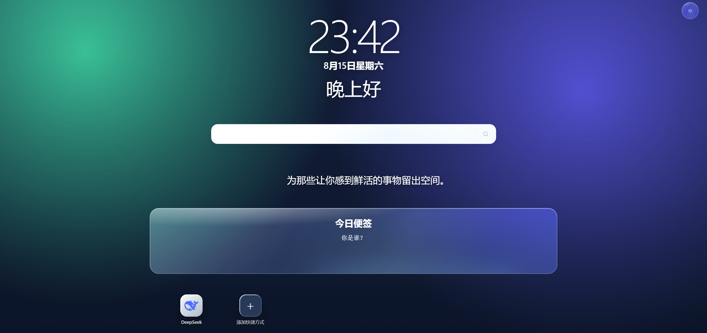

# Isu NewTab

isu 是一款简洁、可自由布局的 Chrome 新标签页扩展。你可以像整理手机桌面一样安排自己的浏览器首页的时钟、搜索、便签、专注计时器和网站快捷方式。

## 主要功能

### 自由排列的桌面

- 时钟与日期、问候语、搜索框、专注计时器、今日便签、每日一语和天气等组件。
- 鼠标左键长按组件约 0.5 秒即可拖动。
- 拖到其他组件所在的位置并短暂停留，桌面会自动腾出空间。
- 右键组件可以水平居中、隐藏或切换可用尺寸。
- 可以随时在设置中恢复默认布局或重新显示隐藏的组件。

### 壁纸与外观

- 支持纯色、内置渐变、本地图片和在线随机壁纸。
- 可以从 Wallhaven 搜索并选择壁纸。
- 支持使用 Unsplash 官方 API 搜索壁纸，并显示摄影师署名。
- 可以调整玻璃模糊强度。
- 可以选择跟随浏览器语言、简体中文或 English；语言选择只保存在当前设备。

### 同步与备份

- 可以选择“仅本地”或使用 Chrome Sync 同步轻量配置。
- Chrome Sync 可同步快捷方式、文件夹、桌面位置、组件设置和壁纸设置。
- 支持将配置导出为 ZIP，也可以从 ZIP 恢复。
- 导出备份时可以选择是否包含本地上传的壁纸。

### 搜索历史

- 默认将最近的搜索记录保存在当前设备，不参与 Isu 的任何同步。
- 可以在“设置 → 搜索框 → 历史来源”中切换为 Chrome 历史。
- 切换到 Chrome 历史时，Chrome 会单独请求读取浏览历史的权限；切回本地或关闭搜索历史后会立即撤销该权限。
- Chrome 历史模式从 Google、Bing、DuckDuckGo、百度和 Yahoo 的搜索结果页中识别搜索词，并可能显示 Chrome 从其他设备同步来的记录。
- 是否能获得跨设备记录取决于用户是否登录 Chrome 并启用“历史记录和标签页”同步。

### 天气

- 显示当前天气、体感温度、今日高低温与降水概率。

## 安装

Google Chrome 扩展市场下载安装：[Isu New Tab](https://chromewebstore.google.com/detail/bicbanpjmmdcmidghgphnclkmbjadebc?utm_source=item-share-cb)

## 快速上手

### 添加网站

点击桌面上的“添加快捷方式”，填写名称和网址后保存。

### 移动组件

在组件或快捷方式上按住鼠标左键约 0.5 秒，进入拖动状态后移动到目标位置并松开。移动过程中在目标位置停留约 0.4 秒，可以预览其他组件让位后的布局。

### 使用右键菜单

- 右键快捷方式：编辑、删除或水平居中。
- 右键文件夹：打开、重命名、删除或水平居中。
- 右键系统组件：隐藏、水平居中或切换尺寸。
- 右键桌面空白处：创建文件夹。

### 设置 Unsplash

Unsplash 官方 API 需要 Access Key：

1. 前往 [Unsplash Applications](https://unsplash.com/oauth/applications) 创建应用。
2. 复制应用的 **Access Key**。
3. 打开“设置 → 壁纸”，将在线壁纸来源切换为 Unsplash。
4. 填写并保存 Access Key。

## 数据与隐私

完整隐私政策见：[PRIVACY_POLICY.md](doc/PRIVACY_POLICY.md)。
